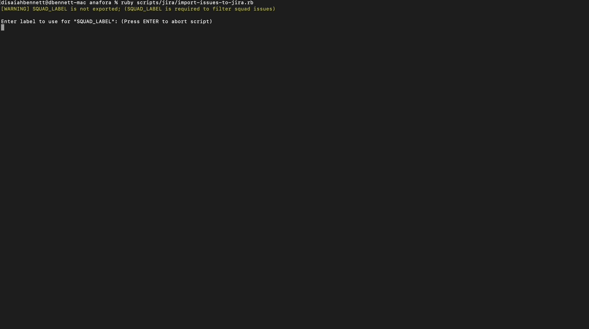
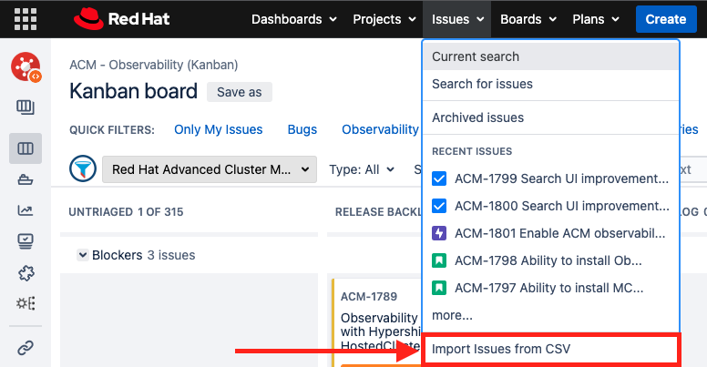

# Jira Issue Importer

Export issues from Github and format the data into a csv file to be imported into Jira.

## Running the importer locally

> Pre-requisites:
>
> - You will need a `GITHUB_TOKEN` that provides read access from the [stolostron/backlog](https://github.com/stolostron/backlog) (private) repository (required to fetch issues from the Github repo label).
> - (Optional) [link](https://app.zenhub.com/settings/tokens) - You will need a `ZENHUB_TOKEN` that provides read access from the [stolostron/backlog](https://github.com/stolostron/backlog) zenhub board (private) repository (required to fetch issue's point estimate from the Github repo).
> - Ruby - [link](https://mac.install.guide/ruby/13.html) for Homebrew.
> - Jira - Access to [Jira](issues.redhat.com) is required to import the issue.

When preparing to import issues from Github to Jira, the target issue must have the following label assigned to the Github item:

- `Move to Jira - Required`

After the label has been assigned, when the script is executed, it will filter for the issues that contains that label and begin to map the issue's fields to the corresponding Jira field within the csv file.

<details>
    <summary>
        The following issue types are supported:
    </summary>

1. Blogs
2. Bugs
3. Enhancements
4. Epics
5. Tasks
6. User Stories

</details>

### Mapping Github IDs to Jira

When extracting the data from Github, the required ID for Jira is not available. To ensure that the right assignees are mapped to the migrated issue, copy the `user.txt.template` file to `user.txt`. Within the `user.txt` file, the user will need to add the Github ID and their Red Hat email that is associated with their Jira account:

```bash
dislbenn,dbennett@redhat.com
```

This will allow the script to easily map the Github user to the Jira account within the csv file.



To execute the script, run the following command:

```bash
ruby scripts/jira/import-issues-to-jira.rb
```

It's recommended that the user export the following variable to help filter for the correct issues within Github:

```bash
export SQUAD_LABEL=<label>
```

If the `SQUAD_LABEL` variable has not been exported, the user will be required to input a value for the label:

```bash
ruby scripts/jira/import-issues-to-jira.rb
[WARNING] SQUAD_LABEL is not exported; (SQUAD_LABEL is required to filter squad issues)

Enter label to use for "SQUAD_LABEL": (Press ENTER to abort script)
squad:observability

SQUAD_LABEL has been set to: squad:observability
```

Next, the user will be prompted to enter in the name of the csv file that will be created:

```bash
Enter the csv filename to be created:
issues.csv
```

After selecting the name of the csv file, the user will then be required to enter in the `component` name that is associated with the issues:

```bash
Enter the name of the Jira component for the issue to be assigned to:
Observability
```

When all of the inputs have been received, the script will begin to fetch the issues and extract the necessary fields to begin mapping the values within the csv file:

```bash
Preparing to write issue type: (bug) to csv file:
(0) bug detected:

Preparing to write issue type: (user_story) to csv file:
(3) user_story detected:

• 18448 - Enable ACM observability collecting the metrics for service mesh applications
No assignee detected.
Label(s): Obs-Core
Severity: 
Priority: Normal
Blocked: false

• 19955 - Ability to install MCO as a part of ACM running on a HyperShift Guest cluster
No assignee detected.
Label(s): Obs-Core
Severity: 
Priority: Normal
Blocked: false

• 19961 - Ability to install Observability  as a part of ACM running on HyperShift Guest cluster
No assignee detected.
Label(s): Obs-Core
Severity: 
Priority: Normal
Blocked: false
```

<details>
    <summary>
        Example csv file results:
    </summary>

```bash
Component/s,Issue Type,Summary,Description,Labels,Assignee,Priority,Severity,Blocked,Epic Name
Observability,story,Enable ACM observability collecting the metrics for service mesh applications,Migrated issue from: https://github.com/stolostron/backlog/issues/18448,Obs-Core,,Normal,,false,,
```
</details>

### Importing CSV to Jira

When the script is done formatting the data within the csv file, the user will be asked if they would like to access Jira. This will open a browser and navigate the user to (<https://issues.redhat.com>).

```bash
Would you like to open Jira to import the issues: (Press ENTER for default: y)
y
Opening Jira (the user maybe required to log into Jira)
```

- **Note**: The user might be prompted to log into Jira.

When logged into Jira, the user will need to select the `Issues` dropdown from the top navigation bar and select `Import Issues from CSV`.



1. Choose the CSV source file (The CSV file that was created from the script).
2. Import to Project: `Red Hat Advanced Cluster Management`
3. Map fields (Within each Jira field, select the matching field from the CSV file).
   1. Make sure to check the box for each to map the field value.
4. Validate that the issues are able to be created properly.
5. View the list of issues that were created and see the imported issues.

### Links

- [Octokit](https://github.com/octokit/octokit.rb)
- [Ruby](https://pine.fm/LearnToProgram/chap_01.html)
